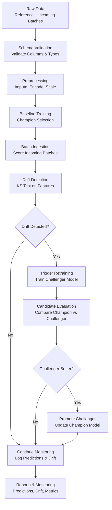

# ML Drift Detection and Retraining Pipeline

An end-to-end MLOps **Drift Detection and Retraining Pipeline** designed to monitor incoming datasets, validate schema consistency, preprocess data, detect statistical distribution drift against a baseline dataset, and trigger retraining workflows to promote champion/challenger models.

The system is built in a modular, configuration-driven way. You can easily switch between different use cases (e.g., **Customer Churn** or **Credit Risk**) by modifying a single active config file.

---

## Project Architecture

The pipeline follows a staged, production-style workflow described by the flowchart below:



### Architecture Component Detail

- **Data Ingestion**: Loads reference baseline data and processes sequential incoming batches from CSV.
- **Schema Validation**: Ensures all expected features, IDs, and target columns conform to the active schema contract before passing data to ML steps.
- **Dynamic Preprocessing**: Handles missing values (imputation), categorical variable encoding (one-hot encoding), numerical scaling, and strictly aligns features to match model expectations.
- **Baseline Model Training**: Trains candidate classifiers (Random Forest, Logistic Regression, Decision Tree) and automatically chooses the best performer as the **Champion**.
- **Batch Scoring**: Predicts churn or default probabilities on incoming batches with the active champion model.
- **Drift Detection**: Performs a feature-by-feature Kolmogorov-Smirnov test (KS-Test) to compare incoming batch data distributions with reference distributions.
- **Retraining Policy**: Evaluates if the proportion of drifted features exceeds the configured threshold.
- **Champion-Challenger Promotion**: Trains a **Challenger** model using the combined reference and batch data, evaluating both on the primary metric. The challenger is promoted only if it outperforms the champion.

---

## Project Structure

The project code is located in the `drift-retrain-platform` directory:

```text
drift-retrain-platform/
│
├── README.md                 # Project-specific README
├── requirements.txt          # Python dependencies
│
├── config/
│   ├── active_config.json    # Selects the active use case
│   └── use_cases/
│       ├── customer_churn/   # Customer Churn use case configurations
│       │   ├── schema.json
│       │   ├── pipeline_config.json
│       │   └── model_config.json
│       └── credit_risk/      # Credit Risk use case configurations
│           ├── schema.json
│           ├── pipeline_config.json
│           └── model_config.json
│
├── src/
│   ├── core/                 # Config loader, schema validator, metadata builder
│   ├── ingestion/            # Dataset loader and batch manager
│   ├── preprocessing/        # Imputer, scaler, encoder, feature alignment
│   ├── drift/                # KS-test drift detector
│   ├── models/               # Training, prediction, and evaluation logic
│   ├── retraining/           # Trigger policy and candidate promotion
│   └── logging_utils/        # Prediction logs, drift logs, metrics logs
│   └── main.py               # Main pipeline execution entry point
│
├── scripts/
│   ├── generate_synthetic_customer_churn.py  # Churn data generator
│   └── generate_synthetic_credit_risk.py     # Credit Risk data generator
│
└── data/                     # Subdirectory created dynamically for data
```

---

## Selectable Use Cases

The pipeline supports selecting a use case dynamically:

### 1. Customer Churn
- **Goal**: Predict customer churn (binary classification).
- **Schema**: 17 features including demographics (`age`, `gender`, `region`), account details (`tenure`, `contract`, `payment_method`), and usage metrics (`monthly_charges`, `avg_monthly_usage_gb`, `support_calls_last_6m`).
- **Target**: `churn` (0 or 1).

### 2. Credit Risk
- **Goal**: Predict loan defaults (binary classification).
- **Schema**: 5 numerical features (`age`, `income`, `loan_amount`, `credit_score`, `tenure`).
- **Target**: `target` (0 = no default, 1 = default).

---

## Getting Started

### 1. Setup Environment
Navigate into the platform directory and install dependencies:

```bash
cd drift-retrain-platform
python -m venv .venv
# On Windows
.venv\Scripts\activate
# On Linux/macOS
source .venv/bin/activate

python -m pip install -r requirements.txt
```

### 2. Select Use Case
To set the active use case, edit `config/active_config.json`:

```json
{
  "active_use_case": "customer_churn"
}
```
*(Or change it to `"credit_risk"` to run the credit risk pipeline).*

### 3. Generate Synthetic Data
Run the generator script that corresponds to your active use case.

**For Customer Churn**:
```bash
python scripts/generate_synthetic_customer_churn.py
```
This generates customer churn CSVs inside `data/reference/` and `data/incoming/`.

**For Credit Risk**:
```bash
python scripts/generate_synthetic_credit_risk.py
```
This generates credit risk CSVs inside `data/credit_risk/reference/` and `data/credit_risk/incoming/`.

### 4. Run the Pipeline
Execute the main orchestrator script:

```bash
python src/main.py
```

---

## Configuration & Customization

Each use case has three primary configuration files under `config/use_cases/<active_use_case>/`:

- **`schema.json`**: Outlines expected column names, numerical features, categorical features, target column, and ID column names.
- **`pipeline_config.json`**: Specifies reference data paths, batch data directory, imputation strategies, scaling rules, and train-test splits.
- **`model_config.json`**: Defines model training type, evaluation metrics (accuracy, f1, roc_auc, etc.), drift p-value thresholds, and retraining policies.

---

## Output Artifacts

After execution, outputs are written to the following paths in `drift-retrain-platform/`:

- **`reports/predictions/`**: Contains CSV exports of batch-level predictions alongside their probabilities.
- **`reports/drift_reports/`**: Contains CSV files summarizing the KS statistic, p-value, drift severity, and detection status for all features.
- **`reports/metrics/`**: Logs validation performance metrics for the baseline model and any retrained challenger models.

---

## Future Improvements
- Integrate **MLflow** for experiment tracking and model registry.
- Introduce **FastAPI** to serve the promoted champion model via HTTP endpoints.
- Package the orchestration workflow inside a **Docker** container.
- Set up **Airflow** or **Prefect** to automate scheduled batch ingestion.
- Build a **Streamlit** front-end dashboard to monitor model drift and retraining events in real-time.
