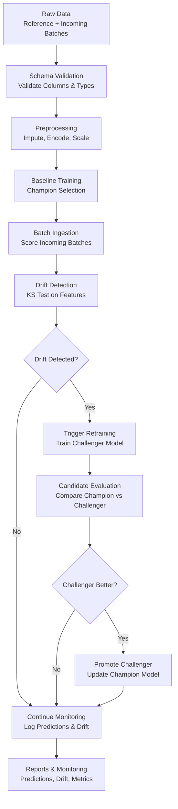

# Automated ML Drift Detection and Retraining Pipeline

An end-to-end Machine Learning monitoring and retraining pipeline that continuously detects data drift, validates schemas, evaluates model performance, and automatically retrains and promotes better-performing models using a Champion–Challenger strategy.

The pipeline is built in a modular, configuration-driven way. You can select the active use case dynamically (e.g., **Customer Churn** or **Credit Risk**) through a central JSON configuration.

---

## Overview

Machine learning models deployed in production gradually lose performance as incoming data characteristics change over time. This phenomenon, known as **data drift** or **concept drift**, causes prediction quality to degrade even though the model remains online and functional.

This project demonstrates a production-style MLOps pipeline that:
* Monitors new incoming batch datasets.
* Validates whether the dataset structure matches the expected schema.
* Preprocesses and aligns features dynamically.
* Compares new incoming data with a baseline/reference dataset.
* Detects statistical feature-level drift and alerts/triggers retraining.
* Trains and evaluates multiple candidate models (Logistic Regression, Decision Trees, Random Forests).
* Employs a **Champion-Challenger** promotion strategy to update models safely.
* Exports detailed logs, predictions, drift reports, and metrics.

The project is designed to simulate how production ML systems are monitored and maintained.

## Problem Statement

Suppose a machine learning model is trained on historical data. Over time:
* Customer behavior changes (e.g., usage patterns drop).
* External factors shift (e.g., inflation increases, contract preferences change).
* Demographics shift, altering the numerical distributions of features.

Although the model continues making predictions, its predictive accuracy degrades because the incoming production data distribution no longer matches the training data distribution.

This pipeline solves that problem by continuously monitoring incoming production batches, detecting distribution shifts, and automatically triggering a retraining-and-promotion workflow whenever the model's environment has drifted.

---

## System Architecture

The pipeline follows a staged, production-style workflow described by the flowchart below:



### Architecture Component Detail

- **Data Ingestion**: Loads reference baseline data and processes sequential incoming batches from CSV.
- **Schema Validation**: Ensures all expected features, IDs, and target columns conform to the active schema contract before passing data to ML steps.
- **Dynamic Preprocessing**: Handles missing values (imputation), categorical variable encoding (one-hot encoding), numerical scaling, and strictly aligns features to match model expectations.
- **Baseline Model Training**: Trains candidate classifiers (Random Forest, Logistic Regression, Decision Tree) and automatically chooses the best performer as the **Champion**.
- **Batch Scoring**: Predicts churn or default probabilities on incoming batches with the active champion model.
- **Drift Detection**: Performs a feature-by-feature Kolmogorov-Smirnov test (KS-Test) to compare incoming batch data distributions with reference distributions.
- **Retraining Policy**: Evaluates if the proportion of drifted features exceeds the configured threshold.
- **Champion-Challenger Promotion**: Trains a **Challenger** model using the combined reference and batch data, evaluating both on the primary metric. The challenger is promoted only if it outperforms the champion.

- Kolmogorov–Smirnov (KS) Test
- Population Stability Index (PSI)

## Selectable Use Cases

The pipeline supports selecting a use case dynamically:

### 1. Customer Churn
* **Goal**: Predict customer churn (binary classification).
* **Schema**: 17 features including demographics (`age`, `gender`, `region`), account details (`tenure`, `contract`, `payment_method`), and usage metrics (`monthly_charges`, `avg_monthly_usage_gb`, `support_calls_last_6m`).
* **Target**: `churn` (0 or 1).

### 2. Credit Risk
* **Goal**: Predict loan defaults (binary classification).
* **Schema**: 5 numerical features (`age`, `income`, `loan_amount`, `credit_score`, `tenure`).
* **Target**: `target` (0 = no default, 1 = default).

---

## Key Features

### 1. Dynamic Preprocessing & Feature Alignment
* **Schema-driven preprocessing**: Handles missing values (imputation), categorical variables (one-hot encoding), and numerical variables (standard scaling).
* **Feature alignment**: Aligns batch features dynamically to match the exact training feature order and presence, ensuring model compatibility on new incoming production data.

### 2. Automatic Model Selection
Instead of hardcoding a single ML algorithm, every retraining cycle automatically trains and evaluates multiple candidate models:
* Random Forest
* Logistic Regression
* Decision Tree

The pipeline evaluates all candidate models and selects the one with the highest performance metric (e.g., F1 score).

**Example Output:**
```text
Random Forest          F1 Score : 0.3450
Logistic Regression    F1 Score : 0.3680
Decision Tree          F1 Score : 0.4110

Selected Model : Decision Tree
Best F1 Score  : 0.4110
```

### 3. Drift Detection
The pipeline continuously compares reference training distributions against incoming production batches using statistical tests (such as the **Kolmogorov–Smirnov (KS) Test**). Each feature is evaluated and assigned a drift score, severity level, and drift status.

**Example Report:**
| Feature | KS Statistic | P-Value | Severity | Drift Detected |
| :--- | :--- | :--- | :--- | :--- |
| Monthly Charges | 0.3420 | 0.000000 | High | ✅ |
| Contract | 0.1850 | 0.000450 | Medium | ✅ |
| Tenure | 0.0820 | 0.124310 | Low | ❌ |

### 4. Retraining Policy
Model retraining is triggered programmatically when the percentage of drifted features exceeds a pre-configured threshold.

**Example Decision:**
```text
Retraining Policy: 9/31 features drifted (29.03%)
Threshold: 20.00%
Decision: Retraining Triggered
```

### 5. Champion–Challenger Strategy
When retraining is triggered, candidate models are trained and the best candidate is compared against the current production model. The new candidate model (the **Challenger**) is promoted to be the active model (the **Champion**) only if it outperforms the champion on the primary validation metric, protecting the production environment from degrading updates.

---

## Repository Structure

The project code is located in the `drift-retrain-platform` directory:

```text
drift-retrain-platform/
│
├── README.md                 # Project-specific README
├── requirements.txt          # Python dependencies
│
├── config/
│   ├── active_config.json    # Selects the active use case
│   └── use_cases/
│       ├── customer_churn/   # Customer Churn use case configurations
│       │   ├── schema.json
│       │   ├── pipeline_config.json
│       │   └── model_config.json
│       └── credit_risk/      # Credit Risk use case configurations
│           ├── schema.json
│           ├── pipeline_config.json
│           └── model_config.json
│
├── src/
│   ├── core/                 # Config loader, schema validator, metadata builder
│   ├── ingestion/            # Dataset loader and batch manager
│   ├── preprocessing/        # Imputer, scaler, encoder, feature alignment
│   ├── drift/                # KS-test drift detector
│   ├── models/               # Training, prediction, and evaluation logic
│   ├── retraining/           # Trigger policy and candidate promotion
│   └── logging_utils/        # Prediction logs, drift logs, metrics logs
│   └── main.py               # Main pipeline execution entry point
│
├── scripts/
│   ├── generate_synthetic_customer_churn.py  # Churn data generator
│   └── generate_synthetic_credit_risk.py     # Credit Risk data generator
│
└── data/                     # Subdirectory created dynamically for data
```

---

## Getting Started

### 1. Setup Environment
Navigate into the platform directory and install dependencies:

```bash
cd drift-retrain-platform
python -m venv .venv
# On Windows
.venv\Scripts\activate
# On Linux/macOS
source .venv/bin/activate

python -m pip install -r requirements.txt
```

### 2. Select Use Case
To set the active use case, edit `config/active_config.json`:

```json
{
  "active_use_case": "customer_churn"
}
```
*(Or change it to `"credit_risk"` to run the credit risk pipeline).*

### 3. Generate Synthetic Data
Run the generator script that corresponds to your active use case.

**For Customer Churn**:
```bash
python scripts/generate_synthetic_customer_churn.py
```
This generates customer churn CSVs inside `data/reference/` and `data/incoming/`.

**For Credit Risk**:
```bash
python scripts/generate_synthetic_credit_risk.py
```
This generates credit risk CSVs inside `data/credit_risk/reference/` and `data/credit_risk/incoming/`.

### 4. Run the Pipeline
Execute the main orchestrator script:

```bash
python src/main.py
```

---

## Output Logs & Artifacts

After execution, outputs are written to the following paths in `drift-retrain-platform/`:

- **`reports/predictions/`**: Contains CSV exports of batch-level predictions alongside their probabilities.
- **`reports/drift_reports/`**: Contains CSV files summarizing the KS statistic, p-value, drift severity, and detection status for all features.
- **`reports/metrics/`**: Logs validation performance metrics for the baseline model and any retrained challenger models.

The primary metric used for model promotion is configurable.

## Learning Outcomes

This project demonstrates core competencies across multiple domains:

### 1. Machine Learning & MLOps
* **Classification Models**: Training, evaluating, and predicting with Random Forests, Logistic Regressions, and Decision Trees.
* **Drift Detection**: Implementing statistical monitoring to detect shifts in feature distributions.
* **Retraining Automation**: Automating retraining triggers and Champion-Challenger validation loops.
* **Production Monitoring**: Tracking performance metrics and generating log audits over time.

### 2. Data Engineering
* **Data Ingestion**: Loading and handling batch datasets programmatically.
* **Dynamic Preprocessing**: Writing reusable scaling, encoding, and imputation pipelines.
* **Feature Alignment**: Aligning schemas across heterogeneous production data batches.
* **Configuration Management**: Building configuration-driven workflows (YAML and JSON schemas).

### Machine Learning

- Classification
- Feature Engineering
- Model Evaluation
- Automatic Model Selection

### Data Engineering

- Data Ingestion
- Batch Processing
- Logging
- Configuration-driven Pipelines

## Contributors

This project was developed as a collaborative effort:

* **AI/ML (Model Development & MLOps)**:
  * Baseline model training and evaluation pipeline.
  * Automatic model selection and champion-challenger promotion.
  * Drift detection statistics (KS-test) and retraining policy triggers.
  * Evaluation logging configurations.

* **Data Engineering (Data Infrastructure & Pipeline)**:
  * Configuration-driven architecture loading config dynamically.
  * Data ingestion, batch management, and sorting layers.
  * Dynamic preprocessing pipelines and feature alignment.
  * Prediction, drift, and metrics logging infrastructure.
  * Synthetic customer churn and credit risk data generators.

---

## Future Improvements
- Integrate **MLflow** for experiment tracking and model registry.
- Introduce **FastAPI** to serve the promoted champion model via HTTP endpoints.
- Package the orchestration workflow inside a **Docker** container.
- Set up **Airflow** or **Prefect** to automate scheduled batch ingestion.
- Build a **Streamlit** front-end dashboard to monitor model drift and retraining events in real-time.
- Introduce model explainability using **SHAP** or **LIME** inside reports.
